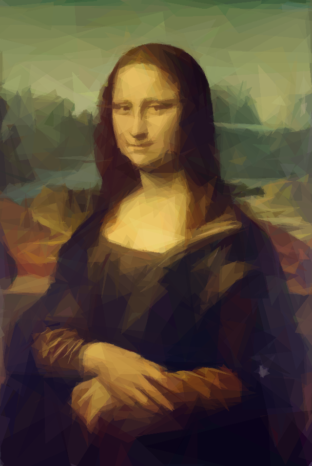

## TriArt
TriArt is a painter that draws images using triangles as the basic shapes.
It uses an evolutionary process to develop progressively better generations of images.

<p align="center">
  
</p>

### Dependencies

```bash
pip install -r requirements.txt
```

### Usage

This command will start the evolution and save the results and statistics to the `saved/<save_name>.pkl` file:
```bash
python3 -m src.triart <image_path> --save_name <save_name> [options]
```
To stop the program at any point, press the Escape key.

For a full list of avaiable options, use:
```bash
python3 -m src.triart -h
```

To generate frames of the best individuals, use:
```bash
python3 -m src.generate_visuals <image_path> <save_name>
```
